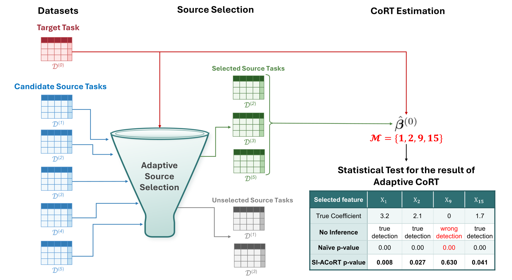
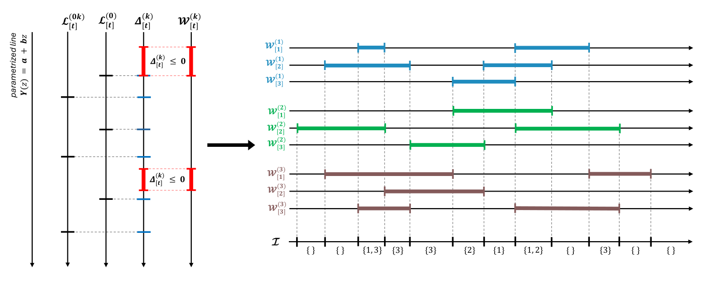
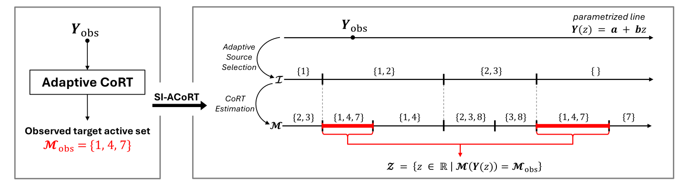

# SI-ACoRT: Statistical Inference for Adaptive CoRT

**SI-ACoRT** is a Python package for statistically valid inference on target
features selected by Adaptive Co-Regularization Transfer (Adaptive CoRT) in
high-dimensional regression.

The framework accounts for the adaptive source-selection and
target-feature-selection mechanisms by conditioning on the target active set
selected by Adaptive CoRT and characterizing the corresponding truncation
region.

---

## 🖼️ Method Overview

### 1. The SI-ACoRT Framework
Adaptive CoRT first identifies informative source tasks through
cross-validation voting and then performs CoRT estimation using the selected
sources. SI-ACoRT computes valid p-values for the resulting target features
while accounting for their data-dependent selection.


*Figure 1: Overview of the Adaptive CoRT pipeline and the role of SI-ACoRT.*

### 2. Source-Selection Regions
Along the parameterized line $\mathbf{Y}(z)=\mathbf{a}+\mathbf{b}z$, the
piecewise-linear Weighted Lasso solution paths determine the foldwise voting
regions. Their boundaries partition the line into intervals on which the
selected source set remains constant.


*Figure 2: Source-selection regions induced by cross-validation voting along the parameterized line.*

### 3. Truncation-Region Construction
Within each source-selection interval, CoRT estimation yields a target active
set. The union of the intervals on which this active set equals
$\mathcal{M}_{\mathrm{obs}}$ forms the truncation region $\mathcal{Z}$.


*Figure 3: Illustration of the construction of the truncation region $\mathcal{Z}$.*

---

## 📦 Requirements

The `homotopy` solver requires Python 3.8+ with
[`numpy`](https://numpy.org/doc/stable/) and
[`scipy`](https://docs.scipy.org/doc/). The `skglm` solver requires Python 3.9+
and [`skglm>=0.5`](https://contrib.scikit-learn.org/skglm/). The parallel pivot
example also uses [`joblib`](https://joblib.readthedocs.io/).

## 🚀 Usage

```python
import numpy as np
from si_acort.SI_ACoRT import SI_ACoRT
from si_acort.gen_data import generate_synthetic_data

p = 500
s = 10
K = 10
n0 = 100
nk = 100

X_list, Y_list, Sigma_list, true_beta0 = generate_synthetic_data(
    p=p, s=s, K=K, num_good_sources=7, n0=n0, nk=nk,
    true_beta=0.5, h=20.0, seed=42,
)
n_list = [X.shape[0] for X in X_list]
lambda_list = [2.0 * np.sqrt(np.log(p) / n) for n in n_list]
lam = 1.0

p_values = SI_ACoRT(
    X_list=X_list, Y_list=Y_list, lambda_list=lambda_list,
    lam=lam, Sigma_list=Sigma_list, T=5,
)

if p_values is None:
    print('No target feature was selected.')
else:
    for j, p_value in p_values:
        print(f'feature={j:3d}  beta*={true_beta0[j]: .3f}  p={p_value:.6f}')
```
